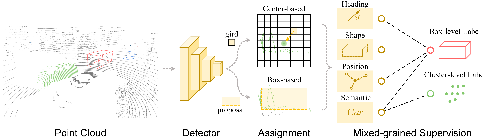
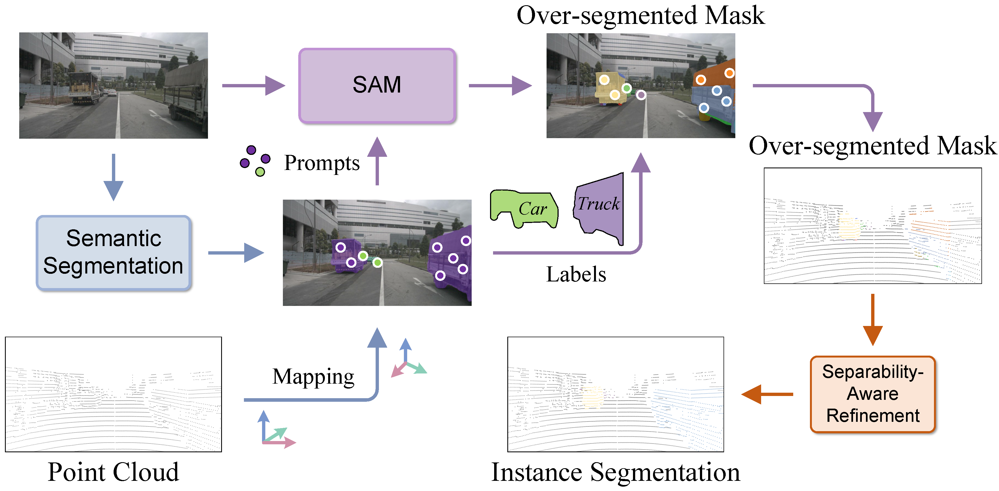
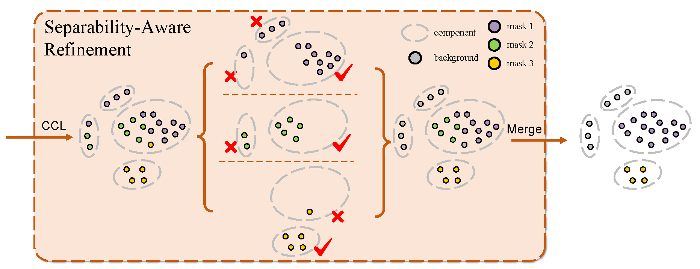
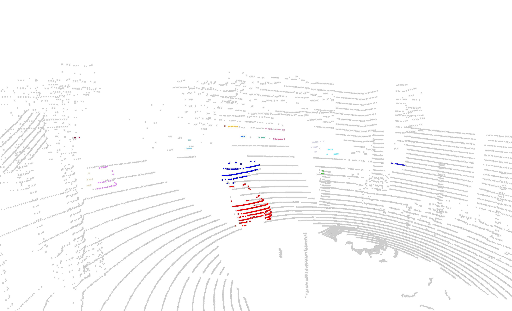
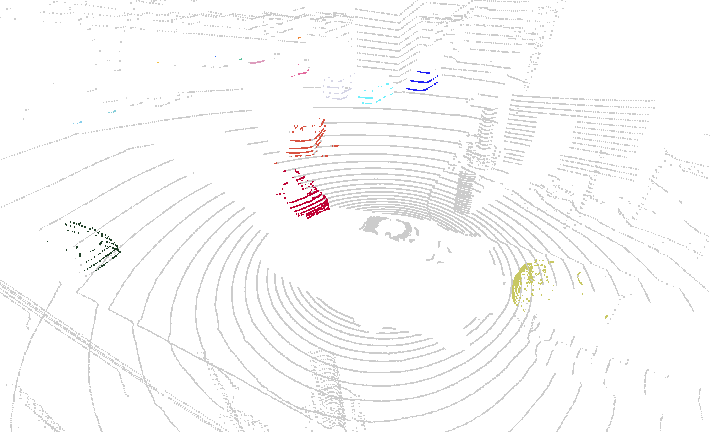
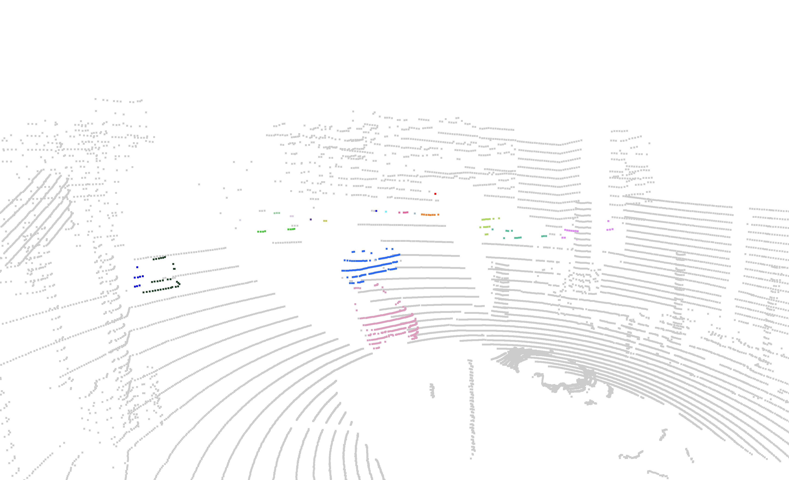
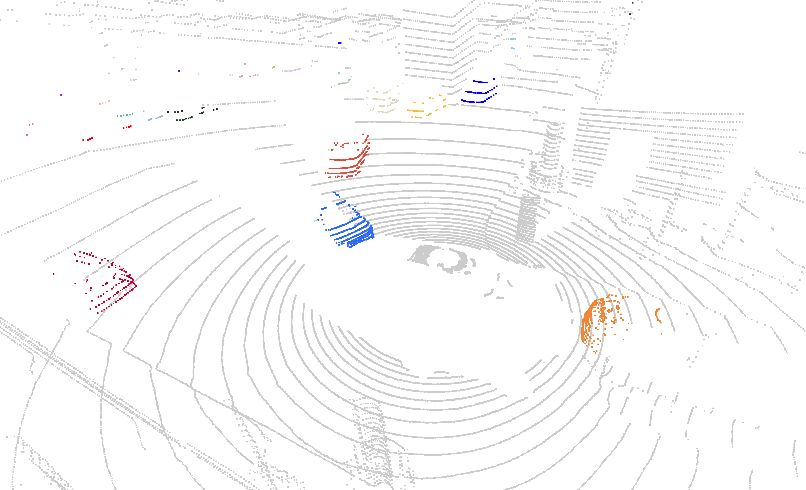

# PointSAM-for-MixSup

## MixSup: Mixed-grained Supervision for Label-efficient LiDAR-based 3D Object Detection (ICLR 2024)

[Yuxue Yang](https://yuxueyang1204.github.io/), [Lue Fan](https://lue.fan/)†, [Zhaoxiang Zhang](https://zhaoxiangzhang.net)† (†: Corresponding Authors)

[ [:bookmark_tabs: Paper](https://arxiv.org/abs/2401.16305) ] [ [:octocat: GitHub Repo](https://github.com/BraveGroup/PointSAM-for-MixSup) ] [ [:paperclip: BibTeX](#citation) ]


> *A good LiDAR-based detector needs massive semantic labels for difficult semantic learning but only a few accurate labels for geometry estimation.*

- **MixSup** is a practical and universality paradigm for label-efficient LiDAR-based 3D object detection, simultaneously utilizing cheap coarse labels and limited accurate labels.
- **MixSup** achieves up to 97.31% of fully supervised performance with cheap cluster-level labels and only 10% box-level labels, which has been validated in nuScenes, Waymo Open Dataset, and KITTI.
- **MixSup** can seamlessly integrate with various 3D detectors, such as [SECOND](https://www.mdpi.com/1424-8220/18/10/3337), [CenterPoint](https://openaccess.thecvf.com/content/CVPR2021/papers/Yin_Center-Based_3D_Object_Detection_and_Tracking_CVPR_2021_paper.pdf), [PV-RCNN](https://openaccess.thecvf.com/content_CVPR_2020/papers/Shi_PV-RCNN_Point-Voxel_Feature_Set_Abstraction_for_3D_Object_Detection_CVPR_2020_paper.pdf), and [FSD](https://proceedings.neurips.cc/paper_files/paper/2022/hash/0247fa3c511bbc415c8b768ee7b32f9e-Abstract-Conference.html).

<p float="left">
    
    
</p>

- **PointSAM** is a simple and effective method for MixSup to automatically segment cluster-level labels, further reducing the annotation burden.
- **PointSAM** is on par with the recent fully supervised panoptic segmentation models for *thing* classes on nuScenes **without any 3D annotations**.

### :raising_hand: Talk is cheap, show me the samples !

| nuScenes Sample Token | 1ac0914c98b8488cb3521efeba354496 | fd8420396768425eabec9bdddf7e64b6 |
| :----------: | :----------: | :----------: |
|PointSAM|  |  |
|Ground Truth|  |  |

### :star2: Panoptic segmentation performance for thing classes on nuScenes validation split

| Methods | PQ<sup>Th</sup> | SQ<sup>Th</sup> | RQ<sup>Th</sup> |
| :-----: | :-------------: | :-------------: | :-------------: |
| [GP-S3Net](https://openaccess.thecvf.com/content/ICCV2021/papers/Razani_GP-S3Net_Graph-Based_Panoptic_Sparse_Semantic_Segmentation_Network_ICCV_2021_paper.pdf) |      56.0       |      85.3       |      65.2       |
| [SMAC-Seg](https://ieeexplore.ieee.org/abstract/document/9812408) |      65.2       |      87.1       |      74.2       |
|[Panoptic-PolarNet](https://openaccess.thecvf.com/content/CVPR2021/papers/Zhou_Panoptic-PolarNet_Proposal-Free_LiDAR_Point_Cloud_Panoptic_Segmentation_CVPR_2021_paper.pdf) |      59.2       |      84.1       |      70.3       |
|[SCAN](https://ojs.aaai.org/index.php/AAAI/article/view/20197) |      60.6       |      85.7       |      70.2       |
|PointSAM (Ours) |      63.7       |      82.6       |      76.9       |

## Installation

### PointSAM

**Step 1.** Create a conda environment and activate it.

```shell
conda create --name MixSup python=3.8 -y
conda activate MixSup
```

**Step 2.** Install PyTorch following [official instructions](https://pytorch.org/get-started/locally/). The codes are tested on PyTorch 1.9.1, CUDA 11.1.

```shell
pip install torch==1.9.1+cu111 torchvision==0.10.1+cu111 -f https://download.pytorch.org/whl/torch_stable.html
```

**Step 3.** Install [Segment Anything](https://github.com/facebookresearch/segment-anything) and [torch_scatter](https://github.com/rusty1s/pytorch_scatter).

```shell
pip install git+https://github.com/facebookresearch/segment-anything.git
pip install https://data.pyg.org/whl/torch-1.9.0%2Bcu111/torch_scatter-2.0.9-cp38-cp38-linux_x86_64.whl
```

**Step 4.** Install other dependencies.

```shell
pip install -r requirements.txt
```

## Dataset Preparation

### nuScenes

Download nuScenes **Full dataset** and **nuScenes-panoptic** (for evaluation) from the [official website](https://www.nuscenes.org/download), then extract and organize the data ito the following structure:

```shell
PointSAM-for-MixSup
└── data
    └── nuscenes
        ├── maps
        ├── panoptic
        ├── samples
        ├── sweeps
        └── v1.0-trainval
```

**Note**: `v1.0-trainval/category.json` and `v1.0-trainval/panoptic.json` in nuScenes-panoptic will replace the original `v1.0-trainval/category.json` and `v1.0-trainval/panoptic.json` of the Full dataset.

## Getting Started

First download the [model checkpoints](#model-checkpoints), then run the following commands to reproduce the results in the paper:

```shell
# single-gpu
bash run.sh

# multi-gpu
bash run_dist.sh
```

**Note**: 
1. The default setting for `run_dist.sh` is to use 8 GPUs. If you want to use less GPUs, please modify the `NUM_GPUS` argument in `run_dist.sh`.
2. You can specify the `SAMPLE_INDICES` between `scripts/indices_train.npy` and `scripts/indices_val.npy` to run PointSAM on train or val split of nuScenes. The default setting is to segment the val split and evaluate the results on panoptic segmentation task.
3. Before running the scripts, please make sure that you have at least 850MB of free space in the `OUT_DIR` folder for val split and 4GB for train split.
4. `segment3D.py` is the main script for PointSAM. The argument `--for_eval` is used to generate labels with the same format as [nuScenes-panoptic for evaluation](https://www.nuscenes.org/panoptic/#results-format), which is not necessary for MixSup. If you just want to utilize PointSAM for MixSup, please remove `--for_eval` in `run.sh` or `run_dist.sh`. We also provide a [script](scripts/convert_results.py) to convert the labels generated by PointSAM between the `.npz` format for nuScenes-panoptic evaluation and `.bin` format for MixSup.

## Model Checkpoints

We adopt [ViT-H SAM](https://github.com/facebookresearch/segment-anything) as the segmentation model for PointSAM and utilize [nuImages](https://www.nuscenes.org/nuimages) pre-trained [HTC](configs/nuimages/htc_x101_64x4d_fpn_dconv_c3-c5_coco-20e_16x1_20e_nuim.py) to integrate semantics for instance masks.

Click the following links to download the model checkpoints and put them in the `ckpt/` folder to be consistent with the configuration in `configs/cfg_PointSAM.py`.

- `ViT-H SAM`: [ViT-H SAM model](https://dl.fbaipublicfiles.com/segment_anything/sam_vit_h_4b8939.pth)
- `HTC`: [HTC model](https://download.openmmlab.com/mmdetection3d/v0.1.0_models/nuimages_semseg/htc_x101_64x4d_fpn_dconv_c3-c5_coco-20e_16x1_20e_nuim/htc_x101_64x4d_fpn_dconv_c3-c5_coco-20e_16x1_20e_nuim_20201008_211222-0b16ac4b.pth)

## TODO

- [x] Publish the code about PointSAM.
- [ ] OpenPCDet based MixSup.
- [ ] MMDetection3D based MixSup.

## Citation

Please consider citing our work as follows if it is helpful.

```
@article{yang2024mixsup,
    title={MixSup: Mixed-grained Supervision for Label-efficient LiDAR-based 3D Object Detection}, 
    author={Yang, Yuxue and Fan, Lue and Zhang, Zhaoxiang},
    journal={arXiv:2401.16305},
    year={2024},
}
```

## Acknowledgement

This project is based on the following repositories.

- [Segment Anything](https://github.com/facebookresearch/segment-anything)
- [FSD](https://github.com/tusen-ai/SST)
- [OpenPCDet](https://github.com/open-mmlab/OpenPCDet)
- [MMDetection3D](https://github.com/open-mmlab/mmdetection3d)